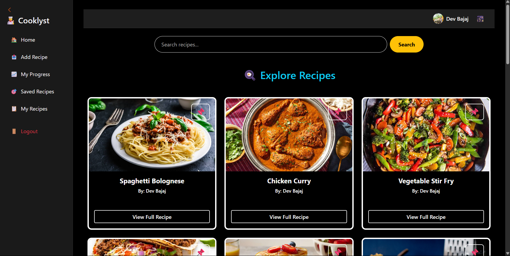
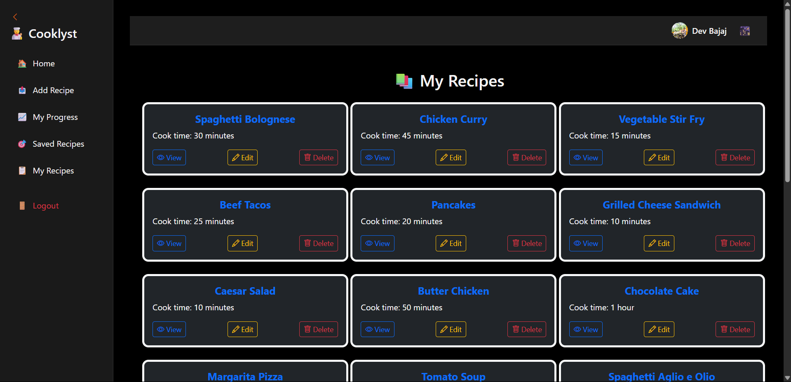
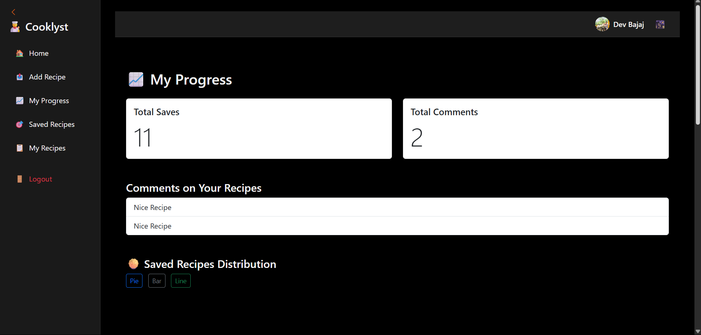
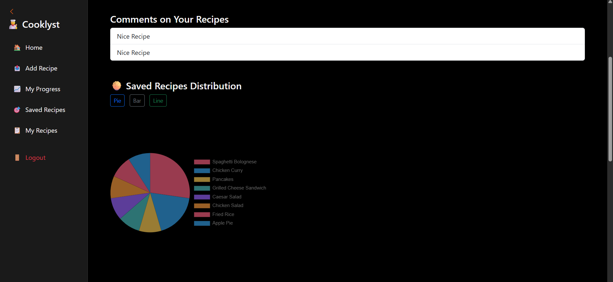
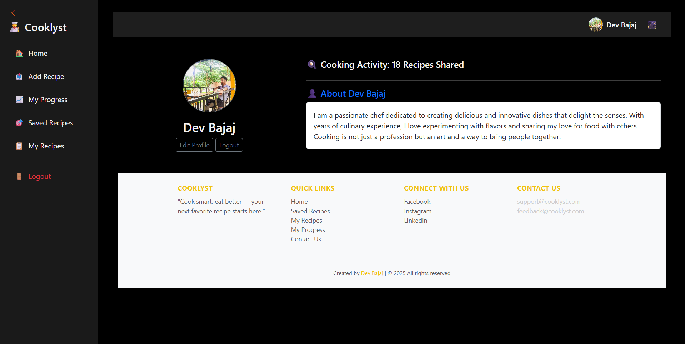
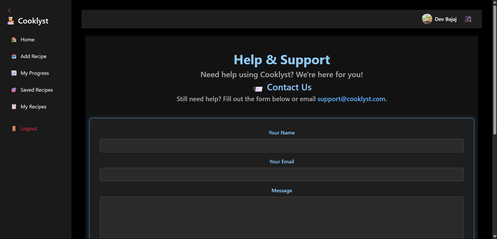

# 🍳 Cooklyst - Recipe Sharing Application

[](https://www.python.org/downloads/)
[](https://flask.palletsprojects.com/)
[](LICENSE)
[](https://github.com/devbajaj20/Cooklyst---Recipe-App/stargazers)

<div align="center">
  
</div>

## 📝 Overview

Cooklyst is a modern web application for sharing and discovering recipes, built with Flask and SQLAlchemy. It provides a platform for food enthusiasts to share their culinary creations, discover new recipes, and connect with other food lovers.

## ✨ Features

### 🎯 Core Features
- 🔐 User authentication and profile management
- 📝 Create, edit, and delete recipes
- 🖼️ Upload recipe images
- ⭐ Save favorite recipes
- 🔍 Search and filter recipes
- 👤 User profiles with recipe collections
- 📱 Responsive design for all devices

## 🛠️ Tech Stack

### Backend
- **Python 3.10+** - Core programming language
- **Flask** - Web framework
- **SQLAlchemy** - ORM for database management
- **Flask-Login** - User authentication
- **Flask-Uploads** - File upload handling
- **Flask-Migrate** - Database migrations

### Frontend
- **HTML5** - Structure
- **CSS3** - Styling
- **JavaScript** - Interactivity
- **Bootstrap** - Responsive design

## 📸 Project Screenshots

### Home Page
<div align="center">
  
</div>

### My Recipes Page
<div align="center">
  
</div>

### Progress Tracking
<div align="center">
  
  
</div>

### User Profile
<div align="center">
  
</div>

### Help and Support
<div align="center">
  
</div>

## 🚀 Getting Started

### Prerequisites
- Python 3.10 or higher
- pip (Python package installer)
- Git

### Installation

1. **Clone the repository**
```bash
git clone https://github.com/devbajaj20/Cooklyst---Recipe-App.git
cd Cooklyst---Recipe-App
```

2. **Create a virtual environment**
```bash
python -m venv venv
source venv/bin/activate  # On Windows: venv\Scripts\activate
```

3. **Install dependencies**
```bash
pip install -r requirements.txt
```

4. **Initialize the database**
```bash
python create_tables.py
```

5. **Run the application**
```bash
python app.py
```

The application will be available at `http://localhost:5000`

## 📁 Project Structure

```
Cooklyst---Recipe-App/
├── app.py              # Main application file
├── models.py           # Database models
├── extensions.py       # Flask extensions
├── create_tables.py    # Database initialization
├── requirements.txt    # Project dependencies
├── static/            # Static files (CSS, images)
│   ├── css/
│   └── uploads/
└── templates/         # HTML templates
    ├── layout.html
    ├── index.html
    └── ...
```


## 📄 License

This project is licensed under the MIT License - see the [LICENSE](LICENSE) file for details.

## 📞 Contact

Project Link: [https://github.com/devbajaj20/Cooklyst---Recipe-App](https://github.com/devbajaj20/Cooklyst---Recipe-App)

---

